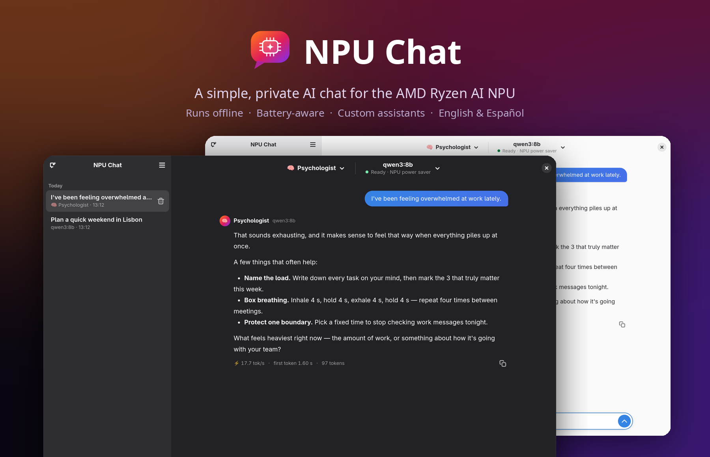

<p align="center">
  
</p>

<p align="center">
  <a href="https://github.com/vezzulab/npuchat/releases/latest"></a>
  
  
</p>

**NPU Chat** is a lightweight desktop app for chatting with local AI models on the NPU of AMD Ryzen AI laptops. It uses [FastFlowLM](https://github.com/FastFlowLM/FastFlowLM) under the hood. No cloud, no browser, no clutter.

## Why NPU Chat?

Most local AI apps on Linux (Ollama, llama.cpp, LM Studio) run models on the CPU or GPU. Ryzen AI laptops also have an **NPU**, a chip built for AI, which usually sits idle. NPU Chat puts it to work:

- **Your CPU and GPU stay free:** the model runs on the NPU, so your machine stays responsive while it writes.
- **Easy on the battery:** the NPU is designed for low-power AI. In our test the laptop drew about the same power while generating as it does at idle.
- **Native and simple:** a small GTK app. No browser tabs, Docker or web-server stack.

<sub>Measured on a Ryzen AI 5 430 on battery with `qwen3.5:9b` in power-saver mode, generating 400 tokens at 11.7 tok/s. CPU use was 6 % (3.5 % at idle) and GPU use 1 %. The whole laptop drew ~8.4 W, versus 8.6 W at idle.</sub>

## Features

- **100% local:** runs on the NPU, works offline.
- **Only models that fit:** checks your NPU, RAM and disk, and shows the expected speed of each model.
- **Assistants:** create your own (psychologist, strategist, chef…) or add one of the 48 in the gallery.
- **Battery-aware:** power saver on battery, full speed when plugged in, and the model is unloaded when idle.
- **Updates itself:** new versions install in one click, verified with SHA-256.
- **The basics, done well:** chat history, Markdown and code blocks, light and dark themes, English and Español.

## Requirements

- An AMD Ryzen AI 300/400 series laptop (XDNA 2 NPU) with Linux kernel 7.0 or newer (or the amdxdna DKMS driver).
- Any current distro: Ubuntu 24.04+, Debian 13, Fedora 39+, Arch and others.
- [FastFlowLM](https://fastflowlm.com/docs/install_lin/) installed. See its guide for Ubuntu and Arch. On Fedora:

  ```bash
  sudo dnf copr enable alessandrolattao/fastflowlm
  sudo dnf install --exclude=xdna-driver-dkms fastflowlm
  sudo flm-fetch-kernels
  ```

## Install

Download `NPU-Chat-x86_64.AppImage` from [Releases](https://github.com/vezzulab/npuchat/releases/latest), then:

```bash
chmod +x NPU-Chat-x86_64.AppImage && ./NPU-Chat-x86_64.AppImage
```

## Build from source

```bash
sudo dnf install gcc meson gtk4-devel libadwaita-devel libsoup3-devel json-glib-devel
./build.sh   # builds and installs to ~/.local
```

## Troubleshooting

**"The NPU needs a system setting to work"** means systemd caps locked memory at 8 MB, and the NPU needs more to load a model. Run this once, then reboot:

```bash
sudo mkdir -p /etc/systemd/system/user@.service.d /etc/systemd/user.conf.d
printf '[Service]\nLimitMEMLOCK=infinity\n' | sudo tee /etc/systemd/system/user@.service.d/memlock.conf
printf '[Manager]\nDefaultLimitMEMLOCK=infinity\n' | sudo tee /etc/systemd/user.conf.d/memlock.conf
```

## License

[MIT](LICENSE)
